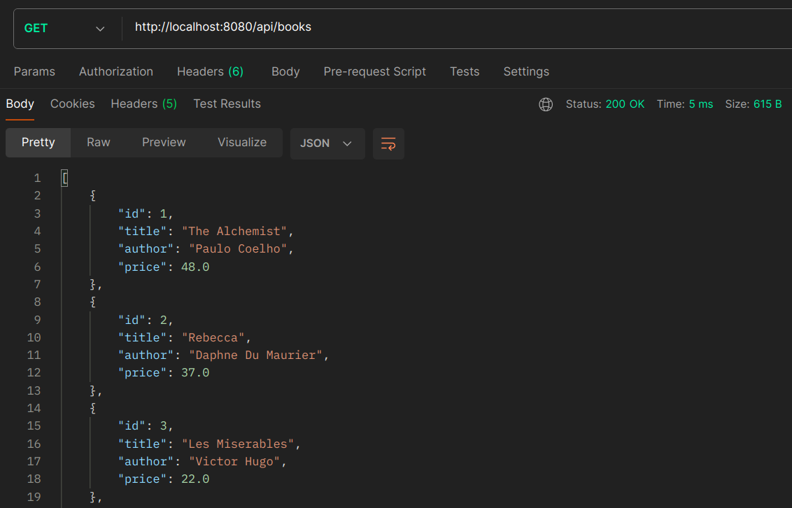
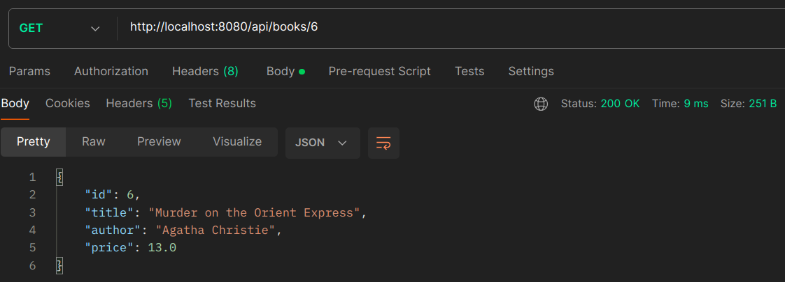
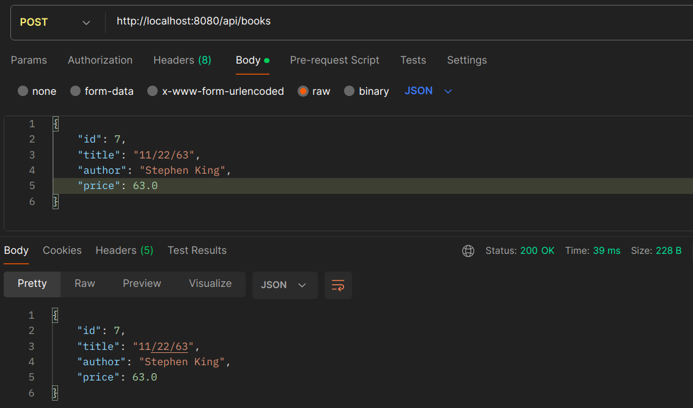
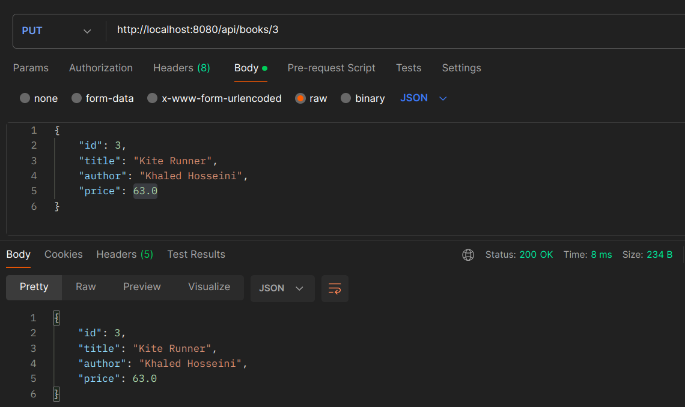
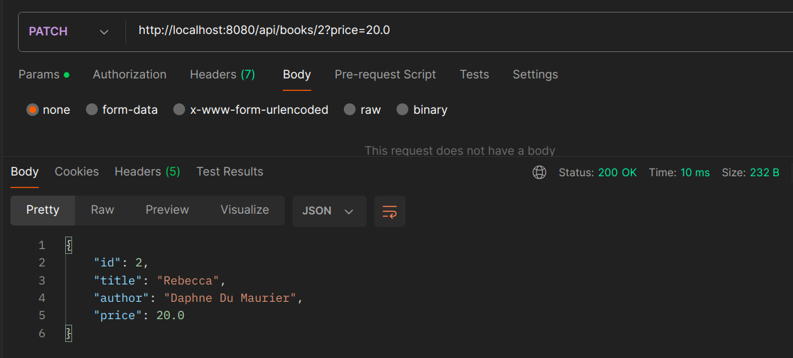
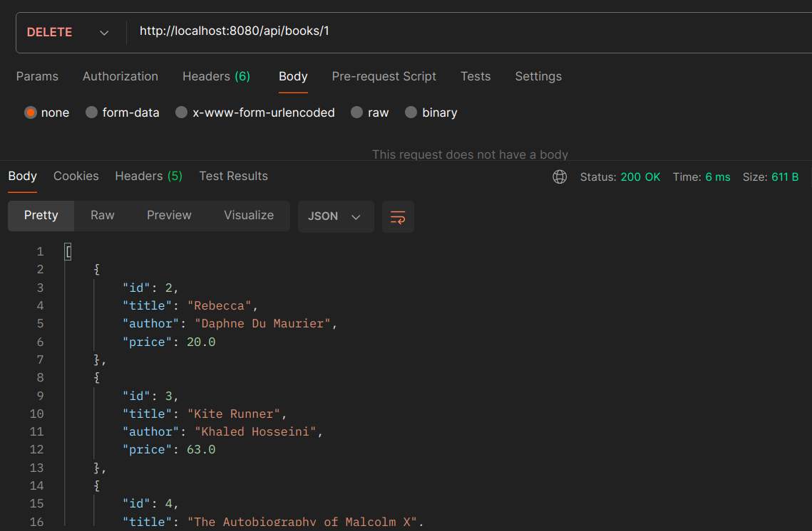
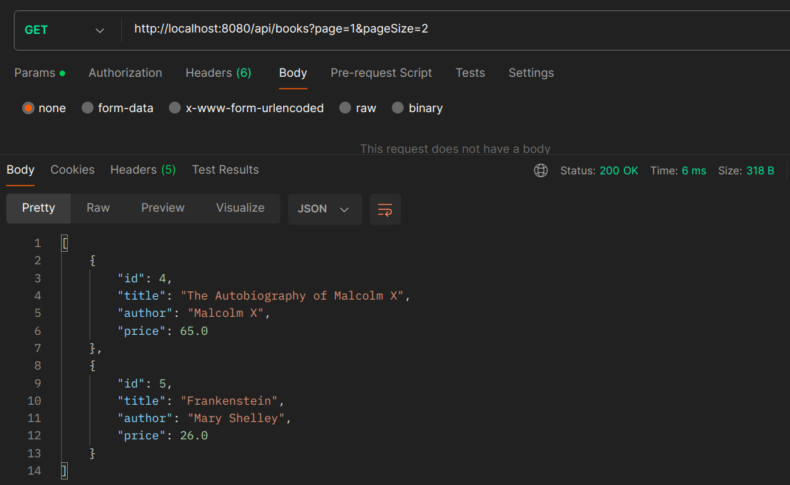
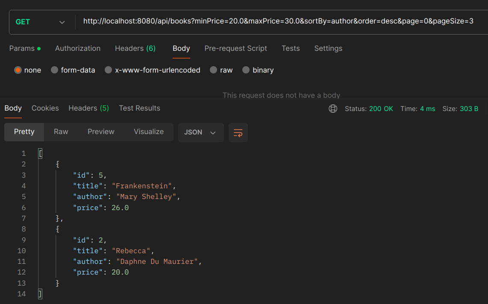

# BooksAPI_AdvancedEndpointFeatures

**Endpoints**

Get all books: `GET /api/books`

Get book of specified ID: `GET /api/books/{id}`

Create a new book: `POST /api/books/`

Update a book: `PUT /api/books/{id}`

Partially update a book: `PATCH /api/books/{id}`

Remove book of specified ID: `DELETE /api/books/{id}`

Get all books (paginated): `GET /api/books?page=<PAGE NUMBER>&pageSize=<ENTRIES PER PAGE>`

Get all books (filtered by price, sorted, and paginated): `GET /api/books?minPrice=<MINIMUM PRICE>&maxPrice=<MAXIMUM PRICE>&sortBy=<ATTRIBUTE>&order=<ORDER>&page=<PAGE NUMBER>&pageSize=<ENTRIES PER PAGE>`
